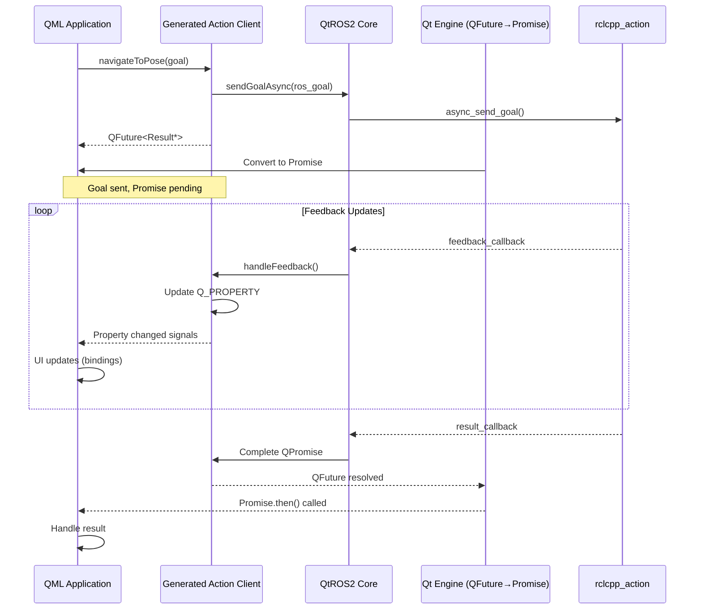
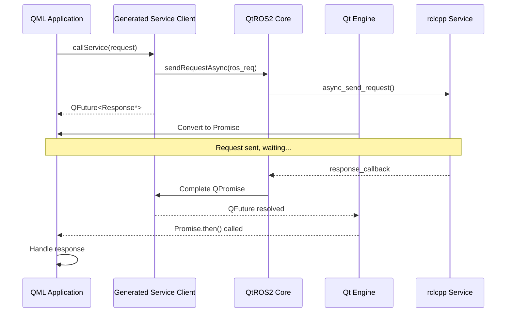
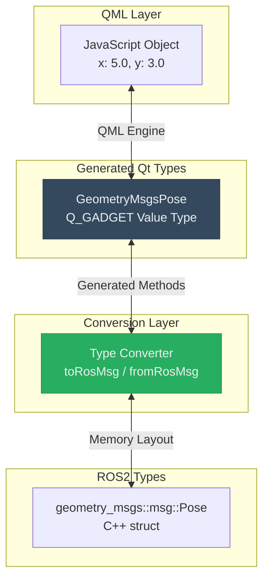
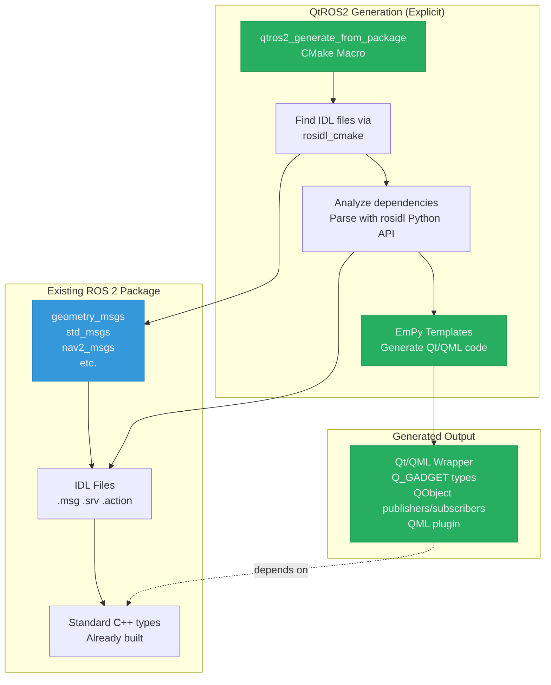

# QtROS2 Proof of Concept

QtROS2 bridges ROS 2 and Qt/QML applications with strongly typed, auto-generated interfaces for messages, services, and actions. It is implemented as a standard Qt module containing the core framework (`Ros2Core`), a rosidl-based code generator (`rosidl_generator_qtros2`), and built-in QML modules for the standard ROS 2 interface families.

## Table of Contents

**Getting Started:**
- [Environment Setup (Ubuntu 24.04)](#environment-setup-ubuntu-2404)
- [Building the Workspace](#building-the-workspace)
- [Developing with Qt Creator](#developing-with-qt-creator)
- [Examples](#examples)
- [QML Usage Highlights](#qml-usage-highlights)

**Project Overview:**
- [Feature Status](#feature-status)
- [Design Principles](#design-principles)
- [Repository Contents](#repository-contents)

**Architecture & Design:**
- [High-Level Architecture](#high-level-architecture)
- [Component Breakdown](#component-breakdown)
- [Threading and Async Handling](#threading-and-async-handling)
- [Communication Patterns](#communication-patterns)
- [Data Flow](#data-flow)
- [Code Generation Pipeline](#code-generation-pipeline)
- [Key Benefits of Value Type Approach](#key-benefits-of-value-type-approach)
- [Build System Integration](#build-system-integration)

**Additional Information:**
- [Future Work](#future-work)
- [Summary](#summary)

## Feature Status

| Capability | Status | Notes |
| --- | --- | --- |
| `Ros2Core` module (`QRos2Node`, publisher/subscriber/service/action client bases, QoS helpers, JS promise bridge) | ✅ Ready | Implemented under `src/core` and exported as a Qt 6 QML module |
| rosidl generator + templates (`qtros2_generate_from_package`, EmPy resources, dependency analyzer) | ✅ Ready | Decoupled from the rosidl plugin registry; invoked explicitly via the macro |
| Built-in QML modules (`QtRos2.StdMsgs`, `QtRos2.GeometryMsgs`, `QtRos2.SensorMsgs`, …) | ✅ Ready | Generated at Qt module build time via `qtros2_generate_from_package()`; third-party packages wrapped on-demand |
| QFuture → Promise support for actions/services | ✅ Ready | Powered by `JsFutureWrapper`, usable from QML today |
| Computed Qt properties on sensor messages (`image` on `sensor_msgs/Image` and `sensor_msgs/CompressedImage`) | ✅ Ready | Converts ROS image data to/from `QImage`; set an image directly from `ImageCapture.imageCaptured` |
| Action/server-side primitives, lifecycle nodes, ROS parameters | ⚙️ Planned | Architectural hooks exist, implementation planned for a future iteration |
| Test coverage, extended docs, tooling polish | ⚙️ Planned | Outstanding work once the API surface stabilizes |

## Design Principles

1. **Strongly Typed** – Generated QML value/QObject types mirror ROS 2 interfaces.
2. **Reactive** – QML properties and signals stay in sync with ROS traffic.
3. **Promise-Friendly** – Asynchronous service/action APIs surface as JavaScript promises.
4. **Zero Boilerplate** – Users run a single CMake macro to wrap existing ROS interface packages.
5. **Qt-Idiomatic** – APIs feel native to Qt/QML developers.

## Repository Contents

```
qt-ros2-bridge/src/
├── src/
│   ├── core/                         # Core Qt/QML module (QtRos2.Core)
│   │   ├── include/                  # Public C++ headers
│   │   │   └── QtRos2Core/
│   │   │       ├── qros2_node.hpp
│   │   │       ├── qros2_publisher_base.hpp
│   │   │       ├── qros2_subscriber_base.hpp
│   │   │       ├── qros2_service_client_base.hpp
│   │   │       ├── qros2_action_client_base.hpp
│   │   │       ├── qros2_qos.hpp
│   │   │       ├── qros2_context.hpp
│   │   │       └── js_future_wrapper.hpp
│   │   └── src/                      # Implementation files
│   │
│   ├── rosidl_generator_qtros2/      # Code generator
│   │   ├── resource/                 # EmPy templates
│   │   └── cmake/                    # CMake macros
│   │
│   ├── messages/                     # Built-in message QML modules
│   │   ├── standard/                 # QtRos2.StdMsgs
│   │   ├── geometry/                 # QtRos2.GeometryMsgs
│   │   ├── sensors/                  # QtRos2.SensorMsgs
│   │   ├── navigation/               # QtRos2.NavMsgs
│   │   └── ... (20+ standard ROS 2 message packages)
│   │
│   ├── services/
│   │   └── standard/                 # QtRos2.StdSrvs
│   │
│   └── interfaces/                   # ROS 2 infrastructure interfaces
│       ├── builtin/
│       ├── rcl/
│       ├── composition/
│       └── type_description/
│
├── examples/                         # Example applications
│   ├── COLCON_IGNORE                 # Excluded from default build
│   ├── simple_publisher/
│   ├── simple_subscriber/
│   ├── turtlesim_controller/
│   ├── RobotMonitor/
│   └── r6botteachpendant/
│
├── tools/                            # Standalone tools
│   └── urdfviewer/                   # URDF file viewer (Qt Quick 3D)
│
└── README.md                         # This document
```

**Key Components:**

- **Ros2Core** — Reusable Qt module providing base classes for ROS 2 entities, QoS configuration, node management, and QFuture→Promise bridging
- **rosidl_generator_qtros2** — Code generator that creates strongly-typed Qt/QML wrappers from ROS 2 interface definitions
- **Built-in message modules** — QML modules for standard ROS 2 message types built into the Qt module (`QtRos2.StdMsgs`, `QtRos2.GeometryMsgs`, `QtRos2.SensorMsgs`, etc.); third-party packages can be wrapped on-demand using `qtros2_generate_from_package()`
- **urdfviewer** — GUI tool for importing URDF robot descriptions and previewing them as Qt Quick 3D scenes (requires `urdf_parser_py` and `jinja2`)
- **examples** — Sample applications demonstrating publishers, subscribers, services, actions, and QML integration (excluded from workspace build by default)

## Environment Setup (Ubuntu 24.04)

QtROS2 requires ROS 2 Jazzy and Qt 6. Follow these steps to set up your build environment:

### Install System Dependencies

```bash
sudo apt update
sudo apt install -y \
  build-essential \
  cmake \
  git \
  ninja-build
```

### Install ROS 2 Jazzy

```bash
# Ensure Ubuntu Universe repository is enabled
sudo apt install -y software-properties-common
sudo add-apt-repository universe

# Add ROS 2 apt repository
sudo apt update && sudo apt install -y curl
export ROS_APT_SOURCE_VERSION=$(curl -s https://api.github.com/repos/ros-infrastructure/ros-apt-source/releases/latest | grep -F "tag_name" | awk -F\" '{print $4}')
curl -L -o /tmp/ros2-apt-source.deb "https://github.com/ros-infrastructure/ros-apt-source/releases/download/${ROS_APT_SOURCE_VERSION}/ros2-apt-source_${ROS_APT_SOURCE_VERSION}.$(. /etc/os-release && echo ${UBUNTU_CODENAME:-${VERSION_CODENAME}})_all.deb"
sudo dpkg -i /tmp/ros2-apt-source.deb

# Install ROS 2 Desktop and development tools
sudo apt update
sudo apt install -y \
  ros-jazzy-desktop \
  ros-dev-tools \
  build-essential \
  cmake \
  git \
  ninja-build
```

### Install Qt 6

Install Qt 6.8 or later using the official Qt online installer from [qt.io/download](https://www.qt.io/download-qt-installer). During installation, select the Desktop gcc 64-bit component and Qt Quick/QML modules.

### Install urdfviewer Dependencies (optional)

The `urdfviewer` tool converts URDF robot descriptions into Qt Quick 3D scenes. It requires Python 3 with two additional packages:

```bash
pip3 install urdf_parser_py jinja2
```

If these packages are not available when `qt-configure-module` is run, the urdfviewer is silently skipped. You can check whether it was detected by looking for the `ros2-urdfviewer` line in the configure summary.

#### Configure qmlls for QtROS2 Module Recognition

The QML Language Server (`qmlls`) needs to recognize the QtROS2 modules through the `QML_IMPORT_PATH` environment variable. By default, Qt Creator launches `qmlls` without preserving environment variables, which prevents it from finding the QtROS2 modules.

**POC Solution:** Create a wrapper script that launches `qmlls` with the `-E` flag (preserve environment):

1. Rename the original `qmlls` executable:
   ```bash
   mv ~/Qt/6.8.3/gcc_64/bin/qmlls ~/Qt/6.8.3/gcc_64/bin/qmlls2
   ```
   *(Adjust the path to match your Qt installation)*

2. Create a new wrapper script at `~/Qt/6.8.3/gcc_64/bin/qmlls`:
   ```bash
   #!/bin/bash

   # Get the directory of this script and construct the executable path
   script_dir="$(cd "$(dirname "${BASH_SOURCE[0]}")" && pwd)"
   executable="$script_dir/qmlls2"

   # Check if executable exists
   if [[ ! -x "$executable" ]]; then
       echo "Error: Executable not found or not executable: $executable" >&2
       exit 1
   fi

   # Run the executable with -E flag to preserve environment variables
   "$executable" -E "$@"
   ```

3. Make the wrapper executable:
   ```bash
   chmod +x ~/Qt/6.8.3/gcc_64/bin/qmlls
   ```

This enables `qmlls` to see the `QML_IMPORT_PATH`, providing proper code completion and type checking for `import QtRos2.GeometryMsgs` and other generated modules.

## Building the Workspace

QtROS2 is built as a Qt module using `qt-configure-module`. CMake needs to locate the ROS 2 libraries; there are two ways to achieve this.

**Option 1 — Source the ROS 2 environment (recommended):**

```bash
source /opt/ros/jazzy/setup.bash

mkdir -p ~/ros2bridge_build && cd ~/ros2bridge_build
~/Qt/6.10.1/gcc_64/bin/qt-configure-module /path/to/qt-ros2-bridge/src

cmake --build . --parallel

# For prefix builds (building against an installed Qt), install into the Qt prefix:
cmake --install .
```

**Option 2 — Pass the ROS 2 path explicitly (useful in CI or when sourcing is not practical):**

```bash
mkdir -p ~/ros2bridge_build && cd ~/ros2bridge_build
~/Qt/6.10.1/gcc_64/bin/qt-configure-module /path/to/qt-ros2-bridge/src \
    -DROS2_PATH=/opt/ros/jazzy

cmake --build . --parallel

# For prefix builds (building against an installed Qt), install into the Qt prefix:
cmake --install .
```

Adjust the Qt path to match your Qt build or installation.

> **Note:** `cmake --install .` is required for **prefix builds** — any build against an
> installed Qt (online installer, system package, or other prefix). For **non-prefix
> (in-tree) builds**, where this module is built as part of a Qt source tree, the install
> step is not needed as files land directly in the build tree.

## Developing with Qt Creator

Launch Qt Creator from a shell where you have already sourced the ROS 2 environment:

```bash
source /opt/ros/jazzy/setup.bash
~/Qt/Tools/QtCreator/bin/qtcreator
```

The Qt Creator path depends on your Qt installation. Source the ROS 2 environment before each Qt Creator session to ensure it can find the ROS 2 libraries and the generated QML modules.

**When to rebuild:**
- After modifying `Ros2Core` source code under `src/core/`
- After modifying rosidl generator templates in `src/rosidl_generator_qtros2/resource/`
- After adding new message packages to wrap

For application development using the generated types, rebuilding is not required — just edit your QML/C++ code and rerun your application.

## Examples

The repository includes five example applications demonstrating different QtROS2 features. Examples are located in the `examples/` directory and excluded from the default workspace build (via `COLCON_IGNORE`).

> **Important:** Before running an example, ensure that all ROS 2 nodes from previous examples are terminated. This includes both the QtROS2 application and any backend ROS 2 nodes (e.g., `turtlesim_node`, simulation launches). Running multiple examples or their ROS 2 counterparts simultaneously can cause conflicts with node names, topics, or TF transforms, leading to unexpected behavior such as incorrect poses or missing data.

### Simple Publisher

**Location:** [examples/simple_publisher](examples/simple_publisher/)

A minimal QML application that publishes `geometry_msgs/PoseStamped` messages to `/simple_publisher_pose`.

**Key features:**
- Demonstrates basic publisher setup with `PoseStampedPublisher`
- Shows object literal construction for complex nested messages
- Displays subscriber count to show connection status
- Publishes random pose data on button click

**Running:**
1. Source the workspace setup script
2. Open `examples/simple_publisher/CMakeLists.txt` in Qt Creator
3. Build and run from Qt Creator

**Observe published messages** (in a separate terminal):
```bash
source /opt/ros/jazzy/setup.bash
ros2 topic echo /simple_publisher_pose
```

### Simple Subscriber

**Location:** [examples/simple_subscriber](examples/simple_subscriber/)

A minimal QML application that subscribes to `geometry_msgs/PoseStamped` messages from `/simple_publisher_pose`.

**Key features:**
- Demonstrates basic subscriber setup with `PoseStampedSubscriber`
- Shows reactive property bindings (`poseSubscriber.message.pose.position`)
- Displays connection status (publisher available/waiting)
- Updates UI automatically when messages arrive via `onMessageReceived` callback

**Running:**
1. Source the workspace setup script
2. Open `examples/simple_subscriber/CMakeLists.txt` in Qt Creator
3. Build and run from Qt Creator

**Note:** Run alongside the `simple_publisher` example to see the full pub/sub communication.

### TurtleSim Controller

**Location:** [examples/turtlesim_controller](examples/turtlesim_controller/)

A comprehensive TurtleSim controller demonstrating all major ROS 2 communication patterns in a single application: publishers, subscribers, services, and actions.

**Key features:**
- **Publisher:** Velocity commands (`geometry_msgs/Twist`) for direct turtle movement control
- **Subscriber:** Turtle pose updates (`turtlesim/Pose`) for real-time position display
- **Service clients:** Spawn new turtles, kill existing turtles, set pen color/width (`turtlesim/srv/*`)
- **Action client:** Rotate to absolute heading (`turtlesim/action/RotateAbsolute`) with feedback and cancellation
- **Multi-turtle support:** Spawn and control multiple turtles dynamically
- **Tabbed interface:** Organized controls for movement, rotation, and pen customization
- **Real-time feedback:** Action progress, service status, connection state

**Running:**
1. Source the workspace setup script
2. Open `examples/turtlesim_controller/CMakeLists.txt` in Qt Creator
3. Build and run from Qt Creator
4. Launch the TurtleSim backend (in a separate terminal):
   ```bash
   source /opt/ros/jazzy/setup.bash
   ros2 run turtlesim turtlesim_node
   ```

**Usage:**
- **Movement tab:** Use directional buttons to drive the turtle around
- **Rotation tab:** Click compass directions to rotate turtle to absolute headings (0°, 90°, 180°, -90°)
- **Pen Control tab:** Change pen color with presets or custom RGB sliders, adjust pen width, toggle pen on/off
- **Spawn/Kill:** Create new turtles at specific positions or remove existing ones

This example serves as a complete reference for integrating all QtROS2 communication patterns in a single application.

### Robot Monitor

**Location:** [examples/RobotMonitor](examples/RobotMonitor/)

A comprehensive robot monitoring and control interface demonstrating production-level QtROS2 usage.

**Key features:**
- **Multiple subscribers:** Map (`nav_msgs/OccupancyGrid`), laser scan (`sensor_msgs/LaserScan`), TF transforms, camera feed, costmaps
- **Action clients:** Nav2 `NavigateToPose`, iRobot Create3 `Dock`/`Undock` actions
- **Publisher:** Velocity commands (`geometry_msgs/TwistStamped`)
- **3D visualization:** Qt Quick 3D scene with robot, map, laser scans, and navigation path
- **Interactive controls:** Click-to-navigate, manual driving controls, docking/undocking
- **Real-time feedback:** Action state, feedback updates, connection status

**Prerequisites:**

Before building this example, install the required ROS 2 package:

```bash
source /opt/ros/jazzy/setup.bash
sudo apt-get install ros-jazzy-turtlebot4-simulator
```

This package provides TurtleBot4 robot simulation and automatically installs required dependencies (e.g., `nav2-msgs` for NavigateToPose action, `irobot-create-msgs` for Dock/Undock actions).

**Running:**
1. Source the workspace setup script
2. Open `examples/RobotMonitor/CMakeLists.txt` in Qt Creator
3. Build and run from Qt Creator
4. Launch the TurtleBot4 simulation (in a separate terminal):
   ```bash
   source /opt/ros/jazzy/setup.bash
   ros2 launch turtlebot4_gz_bringup turtlebot4_gz.launch.py nav2:=true slam:=true localization:=false rviz:=false
   ```

**Note:** You can set `rviz:=true` to compare the Robot Monitor visualization with RViz, but this may cause simulation performance and stability issues on some systems.

### R6 Robot Teach Pendant

**Location:** [examples/r6botteachpendant](examples/r6botteachpendant/)

A professional teach pendant application for controlling a 6-DOF robot arm, demonstrating advanced QtROS2 capabilities including trajectory control, waypoint programming, and 3D visualization.

**Key features:**
- **3D robot visualization:** Real-time robot model rendered with Qt Quick 3D, driven by TF transforms
- **Joint jogging:** Individual joint control with configurable step sizes
- **Waypoint programming:** Capture, store, and replay robot poses
- **Trajectory execution:** Play back waypoint sequences with looping support
- **Real-time feedback:** Joint positions, execution progress, and controller status
- **TF integration:** Custom TF buffer management for transform tracking

**Prerequisites:**

Before building this example, set up the ros2_control demo workspace:

```bash
source /opt/ros/jazzy/setup.bash
mkdir -p ~/ros2_ws/src
cd ~/ros2_ws/src
git clone https://github.com/ros-controls/ros2_control_demos -b ${ROS_DISTRO}
cd ~/ros2_ws/
sudo apt-get update
rosdep update --rosdistro=$ROS_DISTRO
rosdep install --from-paths ./ -i -y --rosdistro ${ROS_DISTRO}
colcon build --merge-install
```

**Running:**
1. Source the workspace setup script
2. Open `examples/r6botteachpendant/CMakeLists.txt` in Qt Creator
3. Build and run from Qt Creator
4. Launch the R6 robot simulation (in a separate terminal):
   ```bash
   source ~/ros2_ws/install/setup.bash
   ros2 launch ros2_control_demo_example_7 r6bot_controller.launch.py
   ```

**Usage:**
- **Jog tab:** Manually control individual joints with +/- buttons or move to home position
- **Waypoints tab:** Capture current robot pose as a waypoint, manage waypoint list, jump to specific poses
- **Replay tab:** Execute waypoint sequences, monitor progress, enable loop mode

## High-Level Architecture


**Legend:**
- 🔵 **Blue** - Qt QML Engine
- 🟢 **Green** - QtROS2 Core Framework (reusable)
- ⚫ **Navy** - Generated Code (application-specific)
- ⬜ **White** - Application Layer & ROS2 Layer

## Component Breakdown

### 1. Application Layer
- **QML Applications**: Robot control interfaces, monitoring dashboards
- **C++ Applications**: High-performance robot controllers

### 2. Generated Module Layer

Automatically generated from ROS 2 interface packages via `qtros2_generate_from_package`:

```cmake
find_package(rosidl_generator_qtros2 REQUIRED)

qtros2_generate_from_package(
    TARGET QtRos2NavMsgs
    SOURCE_PACKAGE nav_msgs
    QML_MODULE_URI QtRos2.NavMsgs
)
```

The macro inspects the package’s declared IDL files, resolves dependencies, and emits:

**Generates:**
- **Value Types** (`Q_GADGET` with `QML_VALUE_TYPE` + `QML_CONSTRUCTIBLE_VALUE`)
  - Qt-friendly message types (e.g., `GeometryMsgsPose`)
  - Service request/response types
  - Action goal/result/feedback types
  - Constructible from JavaScript object literals
  - Lightweight, stack-allocated, copyable
- **QObject Types** (`QObject` with `QML_ELEMENT`)
  - Strongly-typed action clients (e.g., `NavigationServerAction`)
  - Service client wrappers
  - Publisher/Subscriber wrappers
  - Support signals, slots, and properties
- QML plugin registration

### 3. QtROS2 Core Framework

**Base Classes:**
- `QRos2ActionClientBase` - Action client foundation
- `QRos2PublisherBase` - Publisher foundation
- `QRos2SubscriberBase` - Subscriber foundation
- `QRos2ServiceClientBase` - Service client foundation

**Core Services:**
- `QRos2Node` - Wraps `rclcpp::Node`
- `QRos2Context` - Manages ROS2 context
- `QRos2QoS` - Qt wrapper over `rclcpp::QoS`
- `JsFutureWrapper` - Bridges `QFuture<T>` to QML promises
- Type conversion utilities (Qt ↔ ROS2)
- Qt event loop integration

**Async Bridge:**
- `QFuture` → JavaScript Promise conversion (see Threading and Async Handling section)
- Thread-safe continuations with context awareness
- Lifetime management for async operations

### 4. Qt QML Engine

Standard Qt runtime:
- QML/JavaScript execution
- Property binding system
- Event loop

### 5. ROS2 Layer

Standard ROS2 components:
- `rclcpp` - ROS2 C++ client library
- `rclcpp_action` - ROS2 action library
- `rosidl` - Generated ROS2 message types

## Threading and Async Handling

### The Challenge

ROS2 callbacks execute on ROS2 executor threads, while Qt/QML requires UI updates on the main thread. QtROS2 must bridge these threading domains safely and efficiently.

### Strategy: QPromise + QMetaObject::invokeMethod

QtROS2 uses a callback-based approach with Qt's meta-object system for thread-safe communication:

**Pattern:**
1. ROS2 async operations (`async_send_goal`, `async_send_request`) run on rclcpp executor threads
2. ROS2 callbacks receive responses on background threads
3. `QMetaObject::invokeMethod(..., Qt::QueuedConnection)` marshals Qt property updates to the main thread
4. `QPromise<T>` captures async results and is completed from ROS callbacks (thread-safe)
5. The resulting `QFuture<T>` is exposed to QML as a JavaScript Promise

### QFuture → JavaScript Promise Conversion

**The Problem:** Qt Declarative doesn't natively convert `QFuture<T>` to JavaScript Promises (see [QTBUG-101025](https://bugreports.qt.io/browse/QTBUG-101025)).

**Solution:** QtROS2 provides `JsFutureWrapper`, a lightweight bridge that:
- Creates JavaScript Promises from the QML engine's Promise constructor
- Stores resolve/reject callbacks as `QJSValue` handles
- Uses `QFutureWatcher<T>` to monitor `QFuture<T>` completion on the main thread
- Calls the appropriate JavaScript callback (resolve/reject) when the future completes
- Handles exceptions and converts them to promise rejections
- Manages lifetime automatically (self-deletes after promise settles)

**Developer Experience:**
```qml
// Generated action client returns "promise-like" QJSValue
navAction.navigateToPose(goal)
    .then(result => { /* runs on main thread */ })
    .catch(error => { /* runs on main thread */ })
```

From the QML developer's perspective, it's a standard JavaScript Promise. The generated code handles the `QFuture` ↔ Promise bridge transparently.

**Type Inference Limitation:** Currently, the solution returns `QJSValue` wrapping a Promise rather than `QFuture<T>` directly (which QML doesn't yet support per [QTBUG-101025](https://bugreports.qt.io/browse/QTBUG-101025)). This means type information for the promise's resolved value is not available to the QML language server, so `.then()` callback parameters don't have typed autocomplete. However, properties on action clients (like `distanceRemaining`, `currentPose`) have full type support and autocomplete works perfectly for those.

**Future-Proof:** When [QTBUG-101025](https://bugreports.qt.io/browse/QTBUG-101025) is resolved and Qt Declarative adds native `QFuture<T>` → Promise support with preserved type information, combined with QML language server improvements for promise type inference, the generated code can be updated to provide full type safety throughout the promise chain. Since this is generated code, such improvements would be transparent to application developers.

### Benefits of This Approach

1. **Thread Safety by Design**: `QMetaObject::invokeMethod` with `Qt::QueuedConnection` guarantees main thread execution
2. **Familiar API**: JavaScript developers use standard Promise patterns (`.then()` chaining) that will naturally support async/await syntax once [QTBUG-58620](https://bugreports.qt.io/browse/QTBUG-58620) is resolved
3. **Type Safety**: Strongly-typed throughout the C++ layer
4. **Maintainable**: Generated code means consistent patterns across all interfaces
5. **Robust**: `QPointer` guards prevent use-after-delete in async callbacks

This architecture addresses the core threading concerns while maintaining a clean, idiomatic API for QML developers.

## Communication Patterns

### Actions Architecture

Actions require handling three communication channels: Goal, Feedback, and Result.



**Key Points:**
- **Goal Sending**: Returns `QFuture<Result*>`, auto-converted to Promise
- **Feedback Stream**: Continuous property updates via Qt signals
- **Result Completion**: Promise resolves with final result
- **Separation of Concerns**: Promise for completion, Properties for progress

### Messages (Pub/Sub) Architecture

```mermaid
graph LR
    subgraph "Publisher Side"
        QMLP[QML Publisher]
        GENP[Generated Publisher<br/>TwistPublisher]
        COREP[QRos2PublisherBase]
    end
    
    subgraph "ROS2 Network"
        TOPIC[ROS2 Topic<br/>/cmd_vel]
    end
    
    subgraph "Subscriber Side"
        CORES[QRos2SubscriberBase]
        GENS[Generated Subscriber<br/>TwistSubscriber]
        QMLS[QML Subscriber]
    end
    
    QMLP -->|"publish(msg)"| GENP
    GENP -->|"Qt to ROS"| COREP
    COREP -->|"rclcpp::publish()"| TOPIC
    TOPIC -->|"rclcpp callback"| CORES
    CORES -->|"ROS to Qt"| GENS
    GENS -->|"emit messageReceived"| QMLS
    QMLS -->|"Property binding"| QMLS
    
    style GENP fill:#34495e,stroke:#2c3e50,color:#ecf0f1
    style GENS fill:#34495e,stroke:#2c3e50,color:#ecf0f1
    style COREP fill:#27ae60,stroke:#229954,color:#ecf0f1
    style CORES fill:#27ae60,stroke:#229954,color:#ecf0f1
```



### Services Architecture



## Data Flow

### Type Conversion Flow




## Code Generation Pipeline

### Strategy: Standalone Generator Using rosidl Infrastructure

QtROS2 does **not** implement its own ROS2 interface parser. Instead, it provides a **standalone CMake macro** (`qtros2_generate_from_package`) that leverages rosidl's infrastructure without being part of the rosidl plugin registry.

**Key Design Decision:** QtROS2 is **decoupled from the rosidl plugin registry**. This means:
- It's invoked **explicitly** via CMake macros (not automatically during package builds)
- Users have full control over which packages to wrap and when
- No modifications to existing ROS 2 packages required
- Can generate wrappers for any ROS 2 interface package on-demand

The generator uses [rosidl](https://github.com/ros2/rosidl) infrastructure for:
- Finding IDL files (`${PACKAGE}_IDL_FILES` variables)
- Analyzing interface dependencies
- Accessing parsed interface definitions via Python API
- Reusing rosidl's EmPy template system

**Benefits:**
- **No Parser Maintenance**: Leverages rosidl's proven IDL parsing
- **Guaranteed Compatibility**: Uses the same interface definitions as standard ROS 2 generators
- **Edge Cases Handled**: rosidl manages bounded sequences, nested types, package dependencies
- **Flexible Integration**: Generate wrappers only for packages you need, when you need them
- **No Upstream Changes**: Works with unmodified ROS 2 packages

### Pipeline Architecture



**Generation Process:**
1. User calls `qtros2_generate_from_package(SOURCE_PACKAGE geometry_msgs ...)` in CMakeLists.txt
2. CMake macro finds the source package and locates its IDL files
3. Python scripts analyze dependencies and parse interface definitions using rosidl
4. EmPy templates generate Qt-specific C++ code: `Q_GADGET` value types, `QObject` wrappers, QML plugins
5. Generated code includes type conversion methods (Qt ↔ ROS 2)
6. Qt's QML module system registers types for use in QML
7. Generated wrapper package depends on the source package's C++ types

## QML Usage Highlights

These snippets reflect the current generator output and Qt APIs.

### Publishing/Subscribing (geometry_msgs/PoseStamped)

```qml
import QtQuick
import QtQuick.Controls
import QtRos2.Core as Ros2
import QtRos2.GeometryMsgs

Window {
    Ros2.Node {
        id: rosNode
        nodeName: "example_node"

        PoseStampedPublisher {
            id: posePublisher
            topic: "/robot_pose"
        }

        PoseStampedSubscriber {
            id: poseSubscriber
            topic: "/robot_pose"
            onMessageReceived: (msg) => {
                console.log(`Position: x=${msg.pose.position.x}, y=${msg.pose.position.y}`)
            }
        }
    }

    Button {
        text: "Publish Pose"
        enabled: rosNode.initialized
        onClicked: {
            posePublisher.publish({
                header: { frameId: "map" },
                pose: {
                    position: { x: 1.0, y: 2.0, z: 0.0 },
                    orientation: { x: 0.0, y: 0.0, z: 0.0, w: 1.0 }
                }
            })
        }
    }
}
```

### Service Client (std_srvs/SetBool)

```qml
import QtQuick
import QtQuick.Controls
import QtRos2.StdSrvs

Window {
    Node {
        id: rosNode
        nodeName: "service_client_node"

        SetBoolServiceClient {
            id: lightsClient
            topic: "/lights/enable"
        }
    }

    Button {
        text: "Toggle Lights"
        enabled: rosNode.initialized
        onClicked: {
            lightsClient.callService({ data: true })
                .then(response => console.log(response.message))
                .catch(err => console.error(err))
        }
    }
}
```

### Action Client (nav2_msgs/NavigateToPose)

```qml
import QtQuick
import QtQuick.Controls
import QtRos2.Imported.Nav2Msgs

Window {
    Node {
        id: rosNode
        nodeName: "nav_client_node"

        NavigateToPoseActionClient {
            id: navigator
            topic: "navigate_to_pose"

            onFeedbackChanged: {
                console.log(`Distance remaining: ${feedback.distanceRemaining.toFixed(2)} m`)
                console.log(`Navigation time: ${feedback.navigationTime.sec}s`)
            }
        }
    }

    Column {
        Button {
            text: "Navigate to Goal"
            enabled: rosNode.initialized && navigator.isServerReady
            onClicked: {
                navigator.sendGoal({
                    pose: {
                        header: {
                            frameId: "map",
                            stamp: { sec: 0, nanosec: 0 }
                        },
                        pose: {
                            position: { x: 5.0, y: 3.0, z: 0.0 },
                            orientation: { x: 0.0, y: 0.0, z: 0.0, w: 1.0 }
                        }
                    },
                    behaviorTree: ""
                }).then(() => {
                    console.log("Navigation succeeded!")
                }).catch(err => {
                    console.error("Navigation failed:", err)
                })
            }
        }

        Button {
            text: "Cancel Navigation"
            enabled: navigator.state === Ros2ActionClientBase.Accepted ||
                     navigator.state === Ros2ActionClientBase.Requested
            onClicked: navigator.cancelGoal()
        }

        Label {
            text: `Status: ${navigator.state} | Server ready: ${navigator.isServerReady}`
        }
    }
}
```

## Key Benefits of Value Type Approach

### Image Property (sensor_msgs/Image and sensor_msgs/CompressedImage)

Both `sensor_msgs/Image` and `sensor_msgs/CompressedImage` expose a computed `image` Qt property
that converts between ROS image data and `QImage`. This is especially convenient when using
Qt Multimedia's `ImageCapture`, since `imageCaptured` provides a `QImage` (see [QTBUG-145968](https://bugreports.qt.io/browse/QTBUG-145968)
for raw compressed data access):

```qml
import QtMultimedia
import QtRos2.SensorMsgs

CompressedImagePublisher {
    id: imagePublisher
    topic: "/camera/image/compressed"
}

CaptureSession {
    imageCapture: ImageCapture {
        onImageCaptured: (reqId, image) => {
            imagePublisher.publish({ "format": "jpeg", "image": image })
        }
    }
    camera: Camera { active: true }
}
```

`sensor_msgs/Image` exposes `image` as a read-only property (decoded from raw pixel data using
the `encoding` field), while `sensor_msgs/CompressedImage` exposes `image` as read/write
(encodes to JPEG or PNG based on the `format` field).

### Type System Design

- **Message/Service/Action Data**: `Q_GADGET` with `QML_VALUE_TYPE` + `QML_CONSTRUCTIBLE_VALUE`
  - Lightweight, stack-allocated
  - Constructible from JavaScript object literals
  - Copyable by value
  - No QObject overhead

- **Communication Objects**: `QObject`-derived with `QML_ELEMENT`
  - Publishers, Subscribers, Service Clients, Action Clients
  - Support signals, properties, and QML lifecycle
  - Enable reactive UI patterns

### Advantages

1. **✅ Natural JavaScript Syntax**: `publish({ x: 1.0, y: 2.0 })` just works
2. **✅ No Boilerplate**: No `Qt.createQmlObject()` or factory methods needed
3. **✅ Nested Structures**: Deep object literals map directly to nested messages
4. **✅ Type Safety**: Still strongly typed with compile-time checking
5. **✅ Performance**: Value types are lightweight, no heap allocation
6. **✅ Functional Style**: Immutable patterns easier to reason about
7. **✅ IDE Support**: Full autocomplete and type checking for properties and message structures (note: typed promise return values require [QTBUG-101025](https://bugreports.qt.io/browse/QTBUG-101025) resolution and QML language server enhancements to provide complete type inference for `.then()` callbacks)

## Build System Integration

### Wrapping Third-Party ROS 2 Packages

Standard ROS 2 interface families are already wrapped as built-in modules (see `src/messages/` and `src/services/`). For third-party or application-specific packages, use `qtros2_generate_from_package()` directly:

```cmake
find_package(rosidl_generator_qtros2 REQUIRED)
find_package(turtlesim REQUIRED)

qtros2_generate_from_package(
  TARGET turtlesim
  SOURCE_PACKAGE turtlesim
  QML_MODULE_URI QtRos2.Imported.Turtlesim
  QML_OUTPUT_DIRECTORY ${CMAKE_CURRENT_BINARY_DIR}/QtRos2/Imported/Turtlesim
)

qt_add_executable(my_app src/main.cpp)
target_link_libraries(my_app PRIVATE turtlesim_qtcpp)
```

### Application-Specific Wrappers

Applications can generate local wrappers for any ROS 2 package without adding them to the Qt module build:

```cmake
find_package(rosidl_generator_qtros2 REQUIRED)
find_package(turtlesim REQUIRED)

qtros2_generate_from_package(
  TARGET turtlesim
  SOURCE_PACKAGE turtlesim
  QML_MODULE_URI TurtleSimMsgs
  QML_OUTPUT_DIRECTORY ${CMAKE_CURRENT_BINARY_DIR}/TurtleSimMsgs
)

qt_add_executable(my_app src/main.cpp)
target_link_libraries(my_app PRIVATE turtlesim_qtcpp)
```

**Key points:**
- The generator always creates local wrappers (never installs)
- Generated QML modules are available at build/runtime via `QML_OUTPUT_DIRECTORY`
- Applications get lightweight, local-only wrappers by default

The macro creates a `_qtcpp` target containing the generated plugin and exports the associated QML import directory, so Qt Creator automatically picks up the module.

## Future Work

The following features would enhance QtROS2 further:

### Server-Side Primitives
- **Action servers** (currently clients only)
- **Service servers** (currently clients only)

### Advanced ROS 2 Features
- **Lifecycle nodes** — Managed node states and transitions
- **Parameters** — Parameter declaration, dynamic reconfiguration, and event callbacks
- **Component composition** — Support for composable node patterns
- **Security** — SROS2 integration

### Runtime Introspection
- Topic/service discovery APIs
- Node graph visualization data
- Runtime type information queries
- Generic debugging interfaces alongside strongly-typed code

### Quality & Performance
- QoS policy monitoring and diagnostics
- Memory pooling for high-frequency messages
- Zero-copy optimizations
- Comprehensive error reporting and recovery strategies
- Testing infrastructure and CI/CD templates

The POC focuses on proving the viability of the core architecture, code generation strategy, and developer experience. Additional features will be designed and implemented based on real-world usage feedback.

## Summary

QtROS2 bridges ROS2 robotics middleware and Qt's UI framework through automatic code generation and modern async patterns.

**Key Features:**
- **Strongly-typed QML interfaces** — Generated from ROS 2 `.msg`, `.srv`, and `.action` files
- **Value types** — `Q_GADGET` with `QML_CONSTRUCTIBLE_VALUE` for natural JavaScript object literal construction
- **Promise-based async APIs** — QFuture→Promise conversion for actions and services
- **Reactive property bindings** — Real-time feedback updates through Qt signals
- **QoS configuration** — Qt-friendly wrapper for ROS 2 Quality of Service policies
- **Clean architecture** — Separation between data types (value types) and communication objects (QObject types)

This design enables rapid development of sophisticated robot control interfaces while maintaining type safety and Qt/QML idioms.
