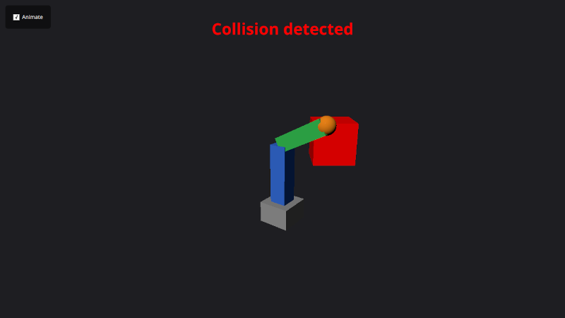
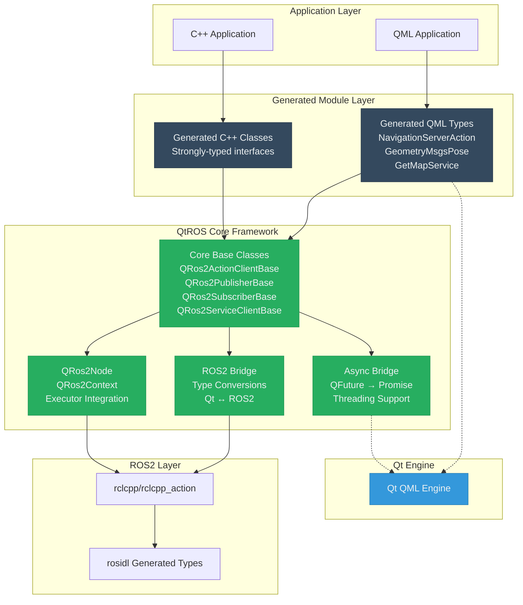
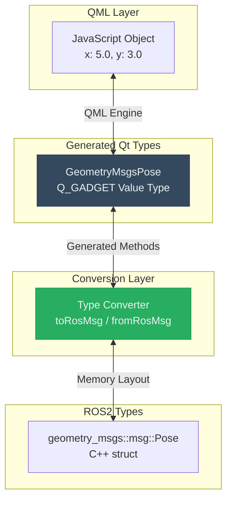
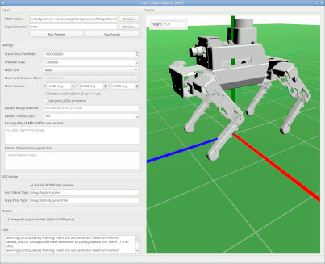

# QtROS

[QtROS](https://doc-snapshots.qt.io/qtros2/qtros2-index.html) bridges 
[ROS 2](https://docs.ros.org/) and Qt/QML applications with strongly typed,
auto-generated interfaces for messages, services, and actions. It is
implemented as a standard Qt module containing the core framework (`Ros2Core`),
a `tf2_ros` wrapper (`Ros2Transforms`), a rosidl-based code generator 
(`rosidl_generator_qtros2`), and built-in QML modules for the standard ROS 2
interface families.

QtROS is an **Experimental Extension** at version 0.1.0: it is usable today, but
the API is not source- or binary-compatible across releases.

## Table of Contents

**Getting Started:**

- [Environment Setup (Ubuntu 24.04 or 26.04)](#environment-setup-ubuntu)
- [Building the Workspace](#building-the-workspace)
- [Building with Docker](#building-with-docker)
  - [Running an Example with Docker](#running-an-example-with-docker)
- [Developing with Qt Creator](#developing-with-qt-creator)
- [Examples](#examples)
- [QML Usage Highlights](#qml-usage-highlights)
- [Generating a Live Model from a URDF file](#generating-a-live-model-from-urdf)

**Project Overview:**

- [Feature Status](#feature-status)
- [Design Principles](#design-principles)
- [Repository Contents](#repository-contents)

**Architecture & Design:**

- [High-Level Architecture](#high-level-architecture)
- [Component Breakdown](#component-breakdown)
- [Threading and Async Handling](#threading-and-async-handling)
- [Communication Patterns](#communication-patterns)
- [Data Flow](#data-flow)
- [Code Generation Pipeline](#code-generation-pipeline)
- [Key Benefits of Value Type Approach](#key-benefits-of-value-type-approach)
- [Build System Integration](#build-system-integration)
  - [Configuring an Application Target](#configuring-an-application-target)
  - [Wrapping Third-Party ROS 2 Packages](#wrapping-third-party-ros-2-packages)
  - [Importing URDF Robot Descriptions](#importing-urdf-robot-descriptions)

**Additional Information:**

- [Future Work](#future-work)
- [Summary](#summary)

## Feature Status


|Capability                                                                                            |Status    |Notes                                                                                                                                      |
|------------------------------------------------------------------------------------------------------|----------|-------------------------------------------------------------------------------------------------------------------------------------------|
|`Ros2Core` module (`Node`, `Context`, entity/QoS plumbing, JS promise bridge)                         |✅ Ready   |Implemented under `src/core` and exported as the `QtRos2.Core` QML module                                                                  |
|rosidl generator + templates (`qtros2_generate_from_package`, EmPy resources, dependency analyzer)    |✅ Ready   |Decoupled from the rosidl plugin registry; invoked explicitly via the macro                                                                |
|Built-in QML modules (`QtRos2.StdMsgs`, `QtRos2.GeometryMsgs`, `QtRos2.SensorMsgs`, …)                |✅ Ready   |21 interface packages generated at Qt module build time; third-party packages wrapped on demand                                            |
|Publishers and subscribers                                                                            |✅ Ready   |Includes automatic `header.stamp` population for stamped messages (`StampedPublisherBase`)                                                 |
|Service clients and service servers                                                                   |✅ Ready   |Declarative `request`/`response` bindings, plus imperative `callService()` promises                                                        |
|Action clients and action servers                                                                     |✅ Ready   |Feedback surfaces as properties; servers get a per-goal handle for feedback/succeed/abort/cancel                                           |
|Node parameters                                                                                       |✅ Ready   |`Parameter` declares a parameter on the local node; `RemoteParameter` binds to another node's parameter                                    |
|Transforms (`QtRos2.Transforms`)                                                                      |✅ Ready   |`TransformBroadcaster`, `StaticTransformBroadcaster`, `FrameTransformer` over `tf2_ros` — see `src/transforms`                             |
|QFuture → Promise support for actions/services                                                        |✅ Ready   |Powered by `JsFutureWrapper`, usable from QML today                                                                                        |
|Computed Qt properties on sensor messages (`image` on `sensor_msgs/Image` and `sensor_msgs/CompressedImage`)|✅ Ready   |Converts ROS image data to/from `QImage`; set an image directly from `ImageCapture.imageCaptured`                                          |
|URDF import (`qt_ros2_import_urdf`, `urdfviewer`)                                                     |✅ Ready   |Generates a Qt Quick 3D QML module, optionally with QtQuick3D.Physics bodies and a ROS bridge                                              |
|Autotests                                                                                             |✅ Ready   |`tests/auto` covers geometry/std/sensor value types, parameters, stamped publishers, node teardown, shutdown, and all three URDF import modes|
|CI                                                                                                    |⚙️ Partial|`.gitlab-ci.yml` builds the base and bindings Docker images; it does not run `ctest` yet                                                   |
|Lifecycle nodes                                                                                       |⚙️ Planned|`lifecycle_msgs` is wrapped as `QtRos2.LifecycleMsgs`, but the managed-node state machine is not implemented                               |
|Runtime introspection (topic/service discovery, node graph)                                           |⚙️ Planned|Nothing beyond `Node.refreshNetworkInterfaces()` today                                                                                     |
|Tooling polish                                                                                        |⚙️ Planned|Outstanding work once the API surface stabilizes                                                                                           |

## Design Principles

1.  **Strongly Typed** – Generated QML value/QObject types mirror ROS 2
    interfaces.
2.  **Reactive** – QML properties and signals stay in sync with ROS traffic.
3.  **Promise-Friendly** – Asynchronous service/action APIs surface as JavaScript
    promises.
4.  **Zero Boilerplate** – Users run a single CMake macro to wrap existing ROS
    interface packages.
5.  **Qt-Idiomatic** – APIs feel native to Qt/QML developers.

## Repository Contents

```
qtros/
├── cmake/                            # Public CMake API, installed with the module
│   ├── QtRos2Macros.cmake            #   qt_ros2_configure_target(), qt_ros2_import_urdf()
│   ├── FindWrapRos2.cmake            #   locates the ROS 2 installation
│   └── rosidl_generator_qtros2Config.cmake
│
├── src/
│   ├── core/                         # Ros2Core module → QML module QtRos2.Core
│   │   ├── qros2context.h            #   the only public header; everything else is _p.h
│   │   ├── qros2node_p.h             #   Node
│   │   ├── qros2contextitem_p.h      #   Context
│   │   ├── qros2entity_p.h           #   Entity / NodeChild base classes
│   │   ├── qros2nodechild_p.h
│   │   ├── qros2parameter_p.h        #   Parameter (local node parameter)
│   │   ├── qros2remoteparameter_p.h  #   RemoteParameter (another node's parameter)
│   │   ├── qros2publisherbase_p.h
│   │   ├── qros2stampedpublisherbase_p.h  # automatic header.stamp
│   │   ├── qros2subscriberbase_p.h
│   │   ├── qros2serviceclientbase_p.h
│   │   ├── qros2serviceserverbase_p.h
│   │   ├── qros2actionclientbase_p.h
│   │   ├── qros2actionserverbase_p.h
│   │   ├── qros2qos_p.h              #   QualityOfService
│   │   └── jsfuturewrapper_p.h       #   QFuture → JavaScript Promise
│   │
│   ├── transforms/                   # Ros2Transforms module → QML module QtRos2.Transforms
│   │                                 #   TransformBroadcaster, StaticTransformBroadcaster,
│   │                                 #   FrameTransformer (wraps tf2_ros)
│   │
│   ├── rosidl_generator_qtros2/      # Code generator
│   │   ├── resource/                 #   EmPy templates (value types, pub/sub,
│   │   │                             #   service client/server, action client/server)
│   │   ├── cmake/                    #   qtros2_generate_from_package() and helpers
│   │   └── rosidl_generator_qtros2/  #   Python package (dependency analyzer, template helpers)
│   │
│   ├── messages/                     # Built-in message QML modules
│   │   ├── standard/                 #   QtRos2.StdMsgs
│   │   ├── geometry/                 #   QtRos2.GeometryMsgs
│   │   ├── sensors/                  #   QtRos2.SensorMsgs
│   │   ├── navigation/               #   QtRos2.NavMsgs
│   │   ├── tf2/                      #   QtRos2.Tf2Msgs
│   │   └── ...                       #   action, diagnostics, lifecycle, rosgraph, service,
│   │                                 #   shapes, statistics, stereo, trajectory,
│   │                                 #   unique_identifier, visualization
│   │
│   ├── services/
│   │   └── standard/                 #   QtRos2.StdSrvs
│   │
│   ├── interfaces/                   # ROS 2 infrastructure interfaces
│   │   ├── builtin/                  #   QtRos2.BuiltinInterfaces
│   │   ├── rcl/                      #   QtRos2.RclInterfaces
│   │   ├── composition/              #   QtRos2.CompositionInterfaces
│   │   └── type_description/         #   QtRos2.TypeDescriptionInterfaces
│   │
│   └── doc/                          # qdoc sources for the QtROS documentation
│
├── examples/                         # Example applications
│   ├── COLCON_IGNORE                 #   excluded from the default build
│   ├── simple_publisher/
│   ├── simple_subscriber/
│   ├── simple_service/
│   ├── simple_service_client/
│   ├── turtlesim_controller/
│   ├── robotarmcollision/
│   ├── RobotMonitor/
│   └── r6botteachpendant/
│
├── tests/
│   ├── auto/                         # geometry, standard, sensors, parameters,
│   │                                 # stampedpublisher, nodelifecycle, shutdown,
│   │                                 # urdfimport, urdfimportros, urdfimportphysics
│   └── manual/
│       └── urdfrobotarm/
│
├── tools/
│   └── urdfviewer/                   # URDF → Qt Quick 3D exporter (script/) and preview GUI (src/)
│
├── docker/                           # Dockerfile.base, Dockerfile.bindings, docker-compose.yml
├── config.tests/                     # configure-time feature checks (urdfviewer Python deps)
└── README.md                         # This document
```
**Key Components:**

- **Ros2Core** — Reusable Qt module providing the node, entity, and context
  plumbing, base classes for every ROS 2 entity (publishers, subscribers,
  service clients/servers, action clients/servers), node parameters, QoS
  configuration, and QFuture→Promise bridging
- **Ros2Transforms** — Hand-written `tf2_ros` wrapper exposing 
  `TransformBroadcaster`, `StaticTransformBroadcaster`, and `FrameTransformer` to
  QML. Distinct from `QtRos2.Tf2Msgs`, which is only the wire types
- **rosidl_generator_qtros2** — Code generator that creates strongly-typed Qt/QML
  wrappers from ROS 2 interface definitions
- **Built-in message modules** — QML modules for standard ROS 2 message types
  built into the Qt module (`QtRos2.StdMsgs`, `QtRos2.GeometryMsgs`, 
  `QtRos2.SensorMsgs`, etc.); third-party packages can be wrapped on-demand using 
  `qtros2_generate_from_package()`
- **urdfviewer** — GUI tool for importing URDF robot descriptions and previewing
  them as Qt Quick 3D scenes (requires `urdf_parser_py` and `jinja2`). Its 
  `urdf2quickexporter.py` script is what `qt_ros2_import_urdf()` calls
- **examples** — Sample applications demonstrating publishers, subscribers,
  services, actions, URDF import, and QML integration (excluded from workspace
  build by default)
- **tests** — Qt autotests (C++ and QML) run with `ctest`, plus manual tests
  under `tests/manual/`

## Environment Setup (Ubuntu 24.04 or 26.04)

QtROS requires ROS 2 Jazzy or Lyrical and Qt 6. Follow these steps to set up
your build environment:

### Install System Dependencies

```bash
sudo apt update
sudo apt install -y \
  build-essential \
  cmake \
  git \
  ninja-build
```
### Install ROS 2 Jazzy

```bash
# Ensure Ubuntu Universe repository is enabled
sudo apt install -y software-properties-common
sudo add-apt-repository universe

# Add ROS 2 apt repository
sudo apt update && sudo apt install -y curl
export ROS_APT_SOURCE_VERSION=$(curl -s https://api.github.com/repos/ros-infrastructure/ros-apt-source/releases/latest | grep -F "tag_name" | awk -F\" '{print $4}')
curl -L -o /tmp/ros2-apt-source.deb "https://github.com/ros-infrastructure/ros-apt-source/releases/download/${ROS_APT_SOURCE_VERSION}/ros2-apt-source_${ROS_APT_SOURCE_VERSION}.$(. /etc/os-release && echo ${UBUNTU_CODENAME:-${VERSION_CODENAME}})_all.deb"
sudo dpkg -i /tmp/ros2-apt-source.deb

# Install ROS 2 Desktop and development tools
sudo apt update
sudo apt install -y \
  ros-jazzy-desktop \
  ros-dev-tools \
  build-essential \
  cmake \
  git \
  ninja-build
```
### Install Qt 6

Install Qt 6.8 or later using the official Qt online installer from 
[qt.io/download](https://www.qt.io/download-qt-installer) or your Linux distro
packages. During installation, select the Desktop gcc 64-bit component and Qt
Quick/QML modules.

### Install urdfviewer Dependencies (optional)

The `urdfviewer` tool converts URDF robot descriptions into Qt Quick 3D scenes.
It requires Python 3 with two additional packages:

```bash
sudo apt install ros-jazzy-urdfdom-py python3-jinja2
```
If these packages are not available when `qt-configure-module` is run, the
urdfviewer is silently skipped. You can check whether it was detected by
looking for the `ros2-urdfviewer` line in the configure summary.

## Building the Workspace

QtROS is built as a Qt module using `qt-configure-module`. CMake needs to locate
the ROS 2 libraries; there are two ways to achieve this.

**Option 1 — Source the ROS 2 environment (recommended):**

```bash
source /opt/ros/jazzy/setup.bash

mkdir -p ~/qtros_build && cd ~/qtros_build
~/Qt/6.12.0/gcc_64/bin/qt-configure-module /path/to/qtros

cmake --build . --parallel

# For prefix builds (building against an installed Qt), install into the Qt prefix:
cmake --install .
```
**Option 2 — Pass the ROS 2 path explicitly (useful in CI or when sourcing is not
practical):**

```bash
mkdir -p ~/qtros_build && cd ~/qtros_build
~/Qt/6.12.0/gcc_64/bin/qt-configure-module /path/to/qtros \
    -DROS2_PATH=/opt/ros/jazzy

cmake --build . --parallel

# For prefix builds (building against an installed Qt), install into the Qt prefix:
cmake --install .
```
Adjust the Qt path to match your Qt build or installation.

> **Note:** `cmake --install .` is required for **prefix builds** — any build
> against an installed Qt (online installer, system package, or other prefix).
> For **non-prefix (in-tree) builds**, where this module is built as part of a Qt
> source tree, the install step is not needed as files land directly in the build
> tree.

## Building with Docker

Rather than installing ROS 2 and Qt on the host, you can build QtROS inside
containers defined under [docker/](docker/). The setup is split into two images:

- `docker/Dockerfile.base` — a toolchain-only image (Ubuntu 24.04 + ROS 2 Jazzy
  \+ Qt 6, installed via the 
  [official Qt installer](https://download.qt.io/official_releases/online_installers/)
  ). It contains no repository source and only needs to be rebuilt when the
  toolchain itself changes.
- `docker/Dockerfile.bindings` — extends the base image (`FROM`), copies the
  repository in, and runs `qt-configure-module` / `cmake --build` / `cmake
  \\--install` to produce the compiled QtROS module.

Building the base image requires a Qt account (free for open-source use)
supplied as build secrets — **never** as `\\--build-arg` or baked into the
image, since build args persist in image history. The images target `linux/amd64`
only, since that's the only Linux desktop architecture the Qt official
installer ships prebuilt packages for; on Apple Silicon hosts, builds run under
emulation and are slower.

Copy `docker/.env.example` to `docker/.env` and fill in your Qt account
credentials, then:

```bash
cd docker
docker compose build base
docker compose build bindings
```
`docker/.env` is git-ignored — never commit it. Compose reads the secrets from
that file automatically (via `secrets: ...: environment: ...`), and 
`docker/.dockerignore`\-equivalent exclusions live in the repo-root 
[.dockerignore](.dockerignore) (see the note in that file about why it can't
live under `docker/`).

### Running an Example with Docker

The `qtros2-bridge:bindings` image builds and installs the `Ros2Core` module and
the generated message modules into the Qt prefix, but the [examples/](examples/)
are excluded from that build (via `examples/COLCON_IGNORE`) so the image stays
focused on the module itself. To run one, start a container and build the
example inside it.

Since the examples are Qt Quick GUI applications, the container needs access to
a display. On a Linux host with a Wayland compositor, forward the Wayland
socket and start an interactive shell:

```bash
docker run -it --rm \
    -e WAYLAND_DISPLAY=$WAYLAND_DISPLAY \
    -e XDG_RUNTIME_DIR=/tmp/runtime \
    -e QT_QPA_PLATFORM=wayland \
    -v $XDG_RUNTIME_DIR/$WAYLAND_DISPLAY:/tmp/runtime/$WAYLAND_DISPLAY \
    --name qtros2 \
    qtros2-bridge:bindings bash
```
Inside the container, the ROS 2 and Qt environments are already sourced for
interactive bash shells (see `/etc/bash.bashrc` in 
[docker/Dockerfile.base](docker/Dockerfile.base)), so you can configure and
build the example directly against the installed Qt/QtROS prefix:

```bash
cd examples/simple_publisher
qt-cmake -S . -B build
cmake --build build --parallel
./build/appsimple_publisher
```
**Observe published messages** (in a second terminal, attached to the same
running container):

```bash
docker exec -it qtros2 bash -c "ros2 topic echo /simple_publisher_pose"
```
The same pattern applies to the other [examples](#examples) — `cd` into the
example directory, build it with `qt-cmake`, and run the resulting `app*` binary.

## Developing with Qt Creator

Launch Qt Creator from a shell where you have already sourced the ROS 2
environment:

```bash
source /opt/ros/jazzy/setup.bash
~/Qt/Tools/QtCreator/bin/qtcreator
```
The Qt Creator path depends on your Qt installation. Source the ROS 2
environment before each Qt Creator session to ensure it can find the ROS 2
libraries and the generated QML modules.

**When to rebuild:**

- After modifying `Ros2Core` source code under `src/core/`
- After modifying rosidl generator templates in 
  `src/rosidl_generator_qtros2/resource/`
- After adding new message packages to wrap

For application development using the generated types, rebuilding is not
required — just edit your QML/C++ code and rerun your application.

## Examples

The repository includes eight example applications demonstrating different
QtROS features. Examples are located in the `examples/` directory and excluded
from the default workspace build (via `COLCON_IGNORE`). Each one also has a 
[documentation page](https://doc-snapshots.qt.io/qtros2/qtros2-examples.html).

> **Important:** Before running an example, ensure that all ROS 2 nodes from
> previous examples are terminated. This includes both the QtROS application and
> any backend ROS 2 nodes (e.g., `turtlesim_node`, simulation launches). Running
> multiple examples or their ROS 2 counterparts simultaneously can cause
> conflicts with node names, topics, or TF transforms, leading to unexpected
> behavior such as incorrect poses or missing data.

### Simple Publisher

**Location:** [examples/simple_publisher](examples/simple_publisher/)

A minimal QML application that publishes `geometry_msgs/PoseStamped` messages to 
`/simple_publisher_pose`.

**Key features:**

- Demonstrates basic publisher setup with `PoseStampedPublisher`
- Shows object literal construction for complex nested messages
- Displays subscriber count to show connection status
- Publishes random pose data on button click

**Running:**

1.  Source the workspace setup script
2.  Open `examples/simple_publisher/CMakeLists.txt` in Qt Creator
3.  Build and run from Qt Creator

**Observe published messages** (in a separate terminal):

```bash
source /opt/ros/jazzy/setup.bash
ros2 topic echo /simple_publisher_pose
```
### Simple Subscriber

**Location:** [examples/simple_subscriber](examples/simple_subscriber/)

A minimal QML application that subscribes to `geometry_msgs/PoseStamped`
messages from `/simple_publisher_pose`.

**Key features:**

- Demonstrates basic subscriber setup with `PoseStampedSubscriber`
- Shows reactive property bindings (`poseSubscriber.message.pose.position`)
- Displays connection status (publisher available/waiting)
- Updates UI automatically when messages arrive via `onMessageReceived` callback

**Running:**

1.  Source the workspace setup script
2.  Open `examples/simple_subscriber/CMakeLists.txt` in Qt Creator
3.  Build and run from Qt Creator

**Note:** Run alongside the `simple_publisher` example to see the full pub/sub
communication.

### Simple Service

**Location:** [examples/simple_service](examples/simple_service/)

A minimal QML application that answers `std_srvs/SetBool` requests on 
`/simple_service_lamp`, switching a "lamp" on and off.

**Key features:**

- Demonstrates the server side of a service with `SetBoolServiceServer`
- Mostly declarative: the `response` property is a binding, evaluated per
  request; no callback is required
- Shows in-band failure handling — the bulb "burns out" after ten cycles and
  the service starts answering `success: false`
- `onRequestReceived` for per-request side effects

**Running:**

1.  Source the workspace setup script
2.  Open `examples/simple_service/CMakeLists.txt` in Qt Creator
3.  Build and run from Qt Creator

**Call the service** (in a separate terminal):

```bash
source /opt/ros/jazzy/setup.bash
ros2 service call /simple_service_lamp std_srvs/srv/SetBool "{data: true}"
```
### Simple Service Client

**Location:** [examples/simple_service_client](examples/simple_service_client/)

The calling side of the Simple Service example: a switch expresses the desired
lamp state and the service response reports what the server actually did.

**Key features:**

- Demonstrates `SetBoolServiceClient` driven by a `request` property binding —
  writing `request` schedules a call, and the result lands in `response`
- Desired-state semantics: calls made while the server is unavailable or
  another call is in flight are coalesced and dispatched when possible (see 
  `ServiceClientBase.autoCall`)
- Also shows the imperative `callService()` promise API

**Running:**

1.  Source the workspace setup script
2.  Open `examples/simple_service_client/CMakeLists.txt` in Qt Creator
3.  Build and run from Qt Creator

**Note:** Run alongside the `simple_service` example, with the same topic, to
see both ends of a service in two Qt windows.

### TurtleSim Controller

**Location:** [examples/turtlesim_controller](examples/turtlesim_controller/)

A comprehensive TurtleSim controller demonstrating all major ROS 2
communication patterns in a single application: publishers, subscribers,
services, and actions.

**Key features:**

- **Publisher:** Velocity commands (`geometry_msgs/Twist`) for direct turtle
  movement control
- **Subscriber:** Turtle pose updates (`turtlesim/Pose`) for real-time position
  display
- **Service clients:** Spawn new turtles, kill existing turtles, set pen
  color/width (`turtlesim/srv/*`)
- **Action client:** Rotate to absolute heading (`turtlesim/action/RotateAbsolute`
  ) with feedback and cancellation
- **Multi-turtle support:** Spawn and control multiple turtles dynamically
- **Tabbed interface:** Organized controls for movement, rotation, and pen
  customization
- **Real-time feedback:** Action progress, service status, connection state

**Running:**

1.  Source the workspace setup script
2.  Open `examples/turtlesim_controller/CMakeLists.txt` in Qt Creator
3.  Build and run from Qt Creator
4.  Launch the TurtleSim backend (in a separate terminal):

    ```bash
    source /opt/ros/jazzy/setup.bash
    ros2 run turtlesim turtlesim_node
    ```
**Usage:**

- **Movement tab:** Use directional buttons to drive the turtle around
- **Rotation tab:** Click compass directions to rotate turtle to absolute
  headings (0°, 90°, 180°, -90°)
- **Pen Control tab:** Change pen color with presets or custom RGB sliders,
  adjust pen width, toggle pen on/off
- **Spawn/Kill:** Create new turtles at specific positions or remove existing ones

This example serves as a complete reference for integrating all QtROS
communication patterns in a single application.

### Robot Arm Collision

**Location:** [examples/robotarmcollision](examples/robotarmcollision/)



A Qt Quick 3D scene generated from a URDF robot description, demonstrating 
`qt_ros2_import_urdf` together with QtQuick3D.Physics collision detection. The
arm is built from `simple_arm.urdf` (links, joints, and convex collision meshes)
and sweeps through a static box obstacle; while any link overlaps the box it
tints red and a "Collision detected" banner is shown.

**Key features:**

- Imports a URDF at build time via `qt_ros2_import_urdf(... PHYSICS ROS_BRIDGE)`
  , generating a `SimpleArm` QML module with QtQuick3DPhysics rigid bodies and
  collision shapes.
- Detects collisions with a `TriggerBody` obstacle; the generated arm links emit
  overlap notifications via the `sendTriggerReports` control property.
- Two drive modes selected with the **Animate** checkbox: a built-in animation
  (the arm spins and sweeps the obstacle), or live joint positions received
  from ROS 2 through the generated `RosBridge`.
- Immediate visual feedback through the red obstacle tint and the on-screen
  banner.

**Running:**

1.  Source the workspace setup script
2.  Open `examples/robotarmcollision/CMakeLists.txt` in Qt Creator
3.  Build and run from Qt Creator

**Usage:**

- **Animate checked:** the arm runs the built-in demo animation and periodically
  collides with the obstacle.
- **Animate unchecked:** the arm is driven by incoming `sensor_msgs/JointState`
  messages on `/joint_states`. Publish joint states to move it, for example with `
  joint_state_publisher_gui` loading `simple_arm.urdf` (in a separate terminal):

  ```bash
  source /opt/ros/jazzy/setup.bash
  ros2 launch examples/robotarmcollision/simple_arm.launch.py
  ```
### Robot Monitor

**Location:** [examples/RobotMonitor](examples/RobotMonitor/)

A comprehensive robot monitoring and control interface demonstrating
production-level QtROS usage.

**Key features:**

- **Multiple subscribers:** Map (`nav_msgs/OccupancyGrid`), laser scan 
(`sensor_msgs/LaserScan`), TF transforms, camera feed, costmaps
- **Action clients:** Nav2 `NavigateToPose`, iRobot Create3 `Dock`/`Undock`
  actions
- **Publisher:** Velocity commands (`geometry_msgs/TwistStamped`)
- **3D visualization:** Qt Quick 3D scene with robot, map, laser scans, and
  navigation path
- **Interactive controls:** Click-to-navigate, manual driving controls,
  docking/undocking
- **Real-time feedback:** Action state, feedback updates, connection status

**Prerequisites:**

Before building this example, install the required ROS 2 package:

```bash
source /opt/ros/jazzy/setup.bash
sudo apt-get install ros-jazzy-turtlebot4-simulator
```
This package provides TurtleBot4 robot simulation and automatically installs
required dependencies (e.g., `nav2-msgs` for NavigateToPose action, i
`irobot-create-msgs` for Dock/Undock actions).

**Running:**

1.  Source the workspace setup script
2.  Open `examples/RobotMonitor/CMakeLists.txt` in Qt Creator
3.  Build and run from Qt Creator
4.  Launch the TurtleBot4 simulation (in a separate terminal):

    ```bash
    source /opt/ros/jazzy/setup.bash
    ros2 launch turtlebot4_gz_bringup turtlebot4_gz.launch.py nav2:=true slam:=true localization:=false rviz:=false
    ```
**Note:** You can set `rviz:=true` to compare the Robot Monitor visualization
with RViz, but this may cause simulation performance and stability issues on
some systems.

### R6 Robot Teach Pendant

**Location:** [examples/r6botteachpendant](examples/r6botteachpendant/)

A professional teach pendant application for controlling a 6-DOF robot arm,
demonstrating advanced QtROS capabilities including trajectory control,
waypoint programming, and 3D visualization.

**Key features:**

- **3D robot visualization:** Real-time robot model rendered with Qt Quick 3D,
  driven by TF transforms
- **Joint jogging:** Individual joint control with configurable step sizes
- **Waypoint programming:** Capture, store, and replay robot poses
- **Trajectory execution:** Play back waypoint sequences with looping support
- **Real-time feedback:** Joint positions, execution progress, and controller
  status
- **TF integration:** Custom TF buffer management for transform tracking

**Prerequisites:**

Before building this example, set up the ros2_control demo workspace:

```bash
source /opt/ros/jazzy/setup.bash
mkdir -p ~/ros2_ws/src
cd ~/ros2_ws/src
git clone https://github.com/ros-controls/ros2_control_demos -b ${ROS_DISTRO}
cd ~/ros2_ws/
sudo apt-get update
sudo rosdep init
rosdep update --rosdistro=$ROS_DISTRO
rosdep install --from-paths ./ -i -y --rosdistro ${ROS_DISTRO}
colcon build --merge-install
```
**Running:**

1.  Source the workspace setup script
2.  Open `examples/r6botteachpendant/CMakeLists.txt` in Qt Creator
3.  Build and run from Qt Creator
4.  Launch the R6 robot simulation (in a separate terminal):

    ```bash
    source ~/ros2_ws/install/setup.bash
    ros2 launch ros2_control_demo_example_7 r6bot_controller.launch.py
    ```
**Usage:**

- **Jog tab:** Manually control individual joints with +/- buttons or move to
  home position
- **Waypoints tab:** Capture current robot pose as a waypoint, manage waypoint
  list, jump to specific poses
- **Replay tab:** Execute waypoint sequences, monitor progress, enable loop mode

### Dogzilla

**Location:** [GitHub](https://github.com/TheQtCompanyRnD/dogzilla)

A larger example: a daemon to run on the Raspberry Pi 5 in the robot, and a
"digital twin" to run on a computer.

## High-Level Architecture


**Legend:**

- 🔵 **Blue** \- Qt QML Engine
- 🟢 **Green** \- QtROS Core Framework (reusable)
- ⚫ **Navy** \- Generated Code (application-specific)
- ⬜ **White** \- Application Layer & ROS2 Layer

## Component Breakdown

### 1\. Application Layer

- **QML Applications**: Robot control interfaces, monitoring dashboards
- **C++ Applications**: High-performance robot controllers

### 2\. Generated Module Layer

Automatically generated from ROS 2 interface packages via 
`qtros2_generate_from_package`:

```cmake
find_package(rosidl_generator_qtros2 REQUIRED)

qtros2_generate_from_package(
    TARGET QtRos2NavMsgs
    SOURCE_PACKAGE nav_msgs
    QML_MODULE_URI QtRos2.NavMsgs
)
```
The macro inspects the package’s declared IDL files, resolves dependencies, and
emits:

**Generates:**

- **Value Types** (`Q_GADGET` with `QML_VALUE_TYPE` \+ `QML_CONSTRUCTIBLE_VALUE`)
  - Qt-friendly message types (e.g., `GeometryMsgsPose`)
  - Service request/response types
  - Action goal/result/feedback types
  - Constructible from JavaScript object literals
  - Lightweight, stack-allocated, copyable
- **QObject Types** (`QObject` with `QML_ELEMENT`)
  - Strongly-typed action clients (e.g., `NavigationServerAction`)
  - Service client wrappers
  - Publisher/Subscriber wrappers
  - Support signals, slots, and properties
- QML plugin registration

### 3\. QtROS Core Framework

**Base Classes:**

- `QRos2PublisherBase` \- Publisher foundation
- `QRos2StampedPublisherBase` \- Adds automatic `header.stamp` population
- `QRos2SubscriberBase` \- Subscriber foundation
- `QRos2ServiceClientBase` \- Service client foundation
- `QRos2ServiceServerBase` \- Service server foundation
- `QRos2ActionClientBase` \- Action client foundation
- `QRos2ActionServerBase` \- Action server foundation

**Core Services:**

- `QRos2Node` \- Wraps `rclcpp::Node`
- `QRos2Context` / `QRos2ContextItem` \- Manage the ROS2 context
- `QRos2Entity` / `QRos2NodeChild` \- Attachment and setup/teardown shared by
  every item hosted by a node
- `QRos2Parameter` \- Declares a parameter on the local node
- `QRos2RemoteParameter` \- Binds to another node's parameter as desired state
- `QRos2QoS` \- Qt wrapper over `rclcpp::QoS`
- `JsFutureWrapper` \- Bridges `QFuture\\\<T>` to QML promises
- Type conversion utilities (Qt ↔ ROS2)
- Qt event loop integration

**Async Bridge:**

- `QFuture` → JavaScript Promise conversion (see Threading and Async Handling
  section)
- Thread-safe continuations with context awareness
- Lifetime management for async operations

### 4\. QtROS Transforms

`Ros2Transforms` (`QtRos2.Transforms`) wraps `tf2_ros` so QML applications do
not have to hand-roll transform publishing and lookup:

- `QRos2TransformBroadcaster` \- Publishes dynamic transforms on `/tf`
- `QRos2StaticTransformBroadcaster` \- Publishes once on the latched `/tf_static`
- `QRos2FrameTransformer` \- Transforms stamped geometry value types into
  another frame

### 5\. Qt QML Engine

Standard Qt runtime:

- QML/JavaScript execution
- Property binding system
- Event loop

### 6\. ROS2 Layer

Standard ROS2 components:

- `rclcpp` \- ROS2 C++ client library
- `rclcpp_action` \- ROS2 action library
- `rosidl` \- Generated ROS2 message types

## Threading and Async Handling

### The Challenge

ROS2 callbacks execute on ROS2 executor threads, while Qt/QML requires UI
updates on the main thread. QtROS must bridge these threading domains safely
and efficiently.

### Strategy: QPromise + QMetaObject::invokeMethod

QtROS uses a callback-based approach with Qt's meta-object system for
thread-safe communication:

**Pattern:**

1.  ROS2 async operations (`async_send_goal`, `async_send_request`) run on
    rclcpp executor threads
2.  ROS2 callbacks receive responses on background threads
3.  `QMetaObject::invokeMethod(..., Qt::QueuedConnection)` marshals Qt property
    updates to the main thread
4.  `QPromise\\\<T>` captures async results and is completed from ROS callbacks
    (thread-safe)
5.  The resulting `QFuture\\\<T>` is exposed to QML as a JavaScript Promise

### QFuture → JavaScript Promise Conversion

**The Problem:** Qt Declarative doesn't natively convert `QFuture\\\<T>` to
JavaScript Promises (see 
[QTBUG-101025](https://bugreports.qt.io/browse/QTBUG-101025)).

**Solution:** QtROS provides `JsFutureWrapper`, a lightweight bridge that:

- Creates JavaScript Promises from the QML engine's Promise constructor
- Stores resolve/reject callbacks as `QJSValue` handles
- Uses `QFutureWatcher\\\<T>` to monitor `QFuture\\\<T>` completion on the main
  thread
- Calls the appropriate JavaScript callback (resolve/reject) when the future
  completes
- Handles exceptions and converts them to promise rejections
- Manages lifetime automatically (self-deletes after promise settles)

**Developer Experience:**

```qml
// Generated action client returns "promise-like" QJSValue
navAction.navigateToPose(goal)
    .then(result => { /* runs on main thread */ })
    .catch(error => { /* runs on main thread */ })
```
From the QML developer's perspective, it's a standard JavaScript Promise. The
generated code handles the `QFuture` ↔ Promise bridge transparently.

**Type Inference Limitation:** Currently, the solution returns `QJSValue`
wrapping a Promise rather than `QFuture\\\<T>` directly (which QML doesn't yet
support per [QTBUG-101025](https://bugreports.qt.io/browse/QTBUG-101025)). This
means type information for the promise's resolved value is not available to the
QML language server, so `.then()` callback parameters don't have typed
autocomplete. However, properties on action clients (like `distanceRemaining`, `
currentPose`) have full type support and autocomplete works perfectly for those.

**Future-Proof:** When 
[QTBUG-101025](https://bugreports.qt.io/browse/QTBUG-101025) is resolved and Qt
Declarative adds native `QFuture\\\<T>` → Promise support with preserved type
information, combined with QML language server improvements for promise type
inference, the generated code can be updated to provide full type safety
throughout the promise chain. Since this is generated code, such improvements
would be transparent to application developers.

### Benefits of This Approach

1.  **Thread Safety by Design**: `QMetaObject::invokeMethod` with `
    Qt::QueuedConnection` guarantees main thread execution
2.  **Familiar API**: JavaScript developers use standard Promise patterns (`
    .then()` chaining) that will naturally support async/await syntax once 
    [QTBUG-58620](https://bugreports.qt.io/browse/QTBUG-58620) is resolved
3.  **Type Safety**: Strongly-typed throughout the C++ layer
4.  **Maintainable**: Generated code means consistent patterns across all
    interfaces
5.  **Robust**: `QPointer` guards prevent use-after-delete in async callbacks

This architecture addresses the core threading concerns while maintaining a
clean, idiomatic API for QML developers.

## Communication Patterns

### Actions Architecture

Actions require handling three communication channels: Goal, Feedback, and
Result.


**Key Points:**

- **Goal Sending**: Returns `QFuture\\\<Result*>`, auto-converted to Promise
- **Feedback Stream**: Continuous property updates via Qt signals
- **Result Completion**: Promise resolves with final result
- **Separation of Concerns**: Promise for completion, Properties for progress

### Messages (Pub/Sub) Architecture

```mermaid
graph LR
    subgraph "Publisher Side"
        QMLP[QML Publisher]
        GENP[Generated Publisher<br/>TwistPublisher]
        COREP[QRos2PublisherBase]
    end
    
    subgraph "ROS2 Network"
        TOPIC[ROS2 Topic<br/>/cmd_vel]
    end
    
    subgraph "Subscriber Side"
        CORES[QRos2SubscriberBase]
        GENS[Generated Subscriber<br/>TwistSubscriber]
        QMLS[QML Subscriber]
    end
    
    QMLP -->|"publish(msg)"| GENP
    GENP -->|"Qt to ROS"| COREP
    COREP -->|"rclcpp::publish()"| TOPIC
    TOPIC -->|"rclcpp callback"| CORES
    CORES -->|"ROS to Qt"| GENS
    GENS -->|"emit messageReceived"| QMLS
    QMLS -->|"Property binding"| QMLS
    
    style GENP fill:#34495e,stroke:#2c3e50,color:#ecf0f1
    style GENS fill:#34495e,stroke:#2c3e50,color:#ecf0f1
    style COREP fill:#27ae60,stroke:#229954,color:#ecf0f1
    style CORES fill:#27ae60,stroke:#229954,color:#ecf0f1
```


### Services Architecture


## Data Flow

### Type Conversion Flow


## Code Generation Pipeline

### Strategy: Standalone Generator Using rosidl Infrastructure

QtROS does **not** implement its own ROS2 interface parser. Instead, it provides
a **standalone CMake macro** (`qtros2_generate_from_package`) that leverages
rosidl's infrastructure without being part of the rosidl plugin registry.

**Key Design Decision:** QtROS is **decoupled from the rosidl plugin registry**.
This means:

- It's invoked **explicitly** via CMake macros (not automatically during package
  builds)
- Users have full control over which packages to wrap and when
- No modifications to existing ROS 2 packages required
- Can generate wrappers for any ROS 2 interface package on-demand

The generator uses [rosidl](https://github.com/ros2/rosidl) infrastructure for:

- Finding IDL files (`${PACKAGE}_IDL_FILES` variables)
- Analyzing interface dependencies
- Accessing parsed interface definitions via Python API
- Reusing rosidl's EmPy template system

**Benefits:**

- **No Parser Maintenance**: Leverages rosidl's proven IDL parsing
- **Guaranteed Compatibility**: Uses the same interface definitions as standard
  ROS 2 generators
- **Edge Cases Handled**: rosidl manages bounded sequences, nested types, package
  dependencies
- **Flexible Integration**: Generate wrappers only for packages you need, when
  you need them
- **No Upstream Changes**: Works with unmodified ROS 2 packages

### Pipeline Architecture


**Generation Process:**

1.  User calls `qtros2_generate_from_package(SOURCE_PACKAGE geometry_msgs ...)`
    in CMakeLists.txt
2.  CMake macro finds the source package and locates its IDL files
3.  Python scripts analyze dependencies and parse interface definitions using
    rosidl
4.  EmPy templates generate Qt-specific C++ code: `Q_GADGET` value types, `
    QObject` wrappers, QML plugins
5.  Generated code includes type conversion methods (Qt ↔ ROS 2)
6.  Qt's QML module system registers types for use in QML
7.  Generated wrapper package depends on the source package's C++ types

## Generating a Live Model from URDF

If you purchase a robot for use with ROS, hopefully it comes with a URDF file.
If you design your own, plugins are available for most CAD systems to export a
URDF file.

You can use the urdfviewer tool to generate a Qt Quick 3D scene containing a
model of your robot, with bindings to subscribers for the most common telemetry
topics, so that if your robot is using standard topics like
`/myrobot/body_pose/state` and `/myrobot/jointstates`, you can see the model
staying in sync with the robot's movements. This is a good starting point for a
digital twin, teach pendant or some other kind of UI that needs to show a live
rendering of the robot's pose; you can then modify the generated code to add
the rest of your desired UI.




## QML Usage Highlights

These snippets reflect the current generator output and Qt APIs.

### Publishing/Subscribing (geometry_msgs/PoseStamped)

```qml
import QtQuick
import QtQuick.Controls
import QtRos2.Core as Ros2
import QtRos2.GeometryMsgs

Window {
    Ros2.Node {
        id: rosNode
        nodeName: "example_node"

        PoseStampedPublisher {
            id: posePublisher
            topic: "/robot_pose"
        }

        PoseStampedSubscriber {
            id: poseSubscriber
            topic: "/robot_pose"
            onMessageReceived: (msg) => {
                console.log(`Position: x=${msg.pose.position.x}, y=${msg.pose.position.y}`)
            }
        }
    }

    Button {
        text: "Publish Pose"
        enabled: rosNode.initialized
        onClicked: {
            posePublisher.publish({
                header: { frameId: "map" },
                pose: {
                    position: { x: 1.0, y: 2.0, z: 0.0 },
                    orientation: { x: 0.0, y: 0.0, z: 0.0, w: 1.0 }
                }
            })
        }
    }
}
```
### Service Client (std_srvs/SetBool)

```qml
import QtQuick
import QtQuick.Controls
import QtRos2.StdSrvs

Window {
    Node {
        id: rosNode
        nodeName: "service_client_node"

        SetBoolServiceClient {
            id: lightsClient
            topic: "/lights/enable"
        }
    }

    Button {
        text: "Toggle Lights"
        enabled: rosNode.initialized
        onClicked: {
            lightsClient.callService({ data: true })
                .then(response => console.log(response.message))
                .catch(err => console.error(err))
        }
    }
}
```
### Action Client (nav2_msgs/NavigateToPose)

```qml
import QtQuick
import QtQuick.Controls
import QtRos2.Imported.Nav2Msgs

Window {
    Node {
        id: rosNode
        nodeName: "nav_client_node"

        NavigateToPoseActionClient {
            id: navigator
            topic: "navigate_to_pose"

            onFeedbackChanged: {
                console.log(`Distance remaining: ${feedback.distanceRemaining.toFixed(2)} m`)
                console.log(`Navigation time: ${feedback.navigationTime.sec}s`)
            }
        }
    }

    Column {
        Button {
            text: "Navigate to Goal"
            enabled: rosNode.initialized && navigator.isServerReady
            onClicked: {
                navigator.sendGoal({
                    pose: {
                        header: {
                            frameId: "map",
                            stamp: { sec: 0, nanosec: 0 }
                        },
                        pose: {
                            position: { x: 5.0, y: 3.0, z: 0.0 },
                            orientation: { x: 0.0, y: 0.0, z: 0.0, w: 1.0 }
                        }
                    },
                    behaviorTree: ""
                }).then(() => {
                    console.log("Navigation succeeded!")
                }).catch(err => {
                    console.error("Navigation failed:", err)
                })
            }
        }

        Button {
            text: "Cancel Navigation"
            enabled: navigator.state === Ros2ActionClientBase.Accepted ||
                     navigator.state === Ros2ActionClientBase.Requested
            onClicked: navigator.cancelGoal()
        }

        Label {
            text: `Status: ${navigator.state} | Server ready: ${navigator.isServerReady}`
        }
    }
}
```
## Key Benefits of Value Type Approach

### Image Property (sensor_msgs/Image and sensor_msgs/CompressedImage)

Both `sensor_msgs/Image` and `sensor_msgs/CompressedImage` expose a computed `
image` Qt property that converts between ROS image data and `QImage`. This is
especially convenient when using Qt Multimedia's `ImageCapture`, since `
imageCaptured` provides a `QImage` (see 
[QTBUG-145968](https://bugreports.qt.io/browse/QTBUG-145968) for raw compressed
data access):

```qml
import QtMultimedia
import QtRos2.SensorMsgs

CompressedImagePublisher {
    id: imagePublisher
    topic: "/camera/image/compressed"
}

CaptureSession {
    imageCapture: ImageCapture {
        onImageCaptured: (reqId, image) => {
            imagePublisher.publish({ "format": "jpeg", "image": image })
        }
    }
    camera: Camera { active: true }
}
```
`sensor_msgs/Image` exposes `image` as a read-only property (decoded from raw
pixel data using the `encoding` field), while `sensor_msgs/CompressedImage`
exposes `image` as read/write (encodes to JPEG or PNG based on the `format`
field).

### Type System Design

- **Message/Service/Action Data**: `Q_GADGET` with `QML_VALUE_TYPE` \+ `
  QML_CONSTRUCTIBLE_VALUE`
  - Lightweight, stack-allocated
  - Constructible from JavaScript object literals
  - Copyable by value
  - No QObject overhead
- **Communication Objects**: `QObject`\-derived with `QML_ELEMENT`
  - Publishers, Subscribers, Service Clients, Action Clients
  - Support signals, properties, and QML lifecycle
  - Enable reactive UI patterns

### Advantages

1.  **✅ Natural JavaScript Syntax**: `publish({ x: 1.0, y: 2.0 })` just works
2.  **✅ No Boilerplate**: No `Qt.createQmlObject()` or factory methods needed
3.  **✅ Nested Structures**: Deep object literals map directly to nested messages
4.  **✅ Type Safety**: Still strongly typed with compile-time checking
5.  **✅ Performance**: Value types are lightweight, no heap allocation
6.  **✅ Functional Style**: Immutable patterns easier to reason about
7.  **✅ IDE Support**: Full autocomplete and type checking for properties and
    message structures (note: typed promise return values require 
    [QTBUG-101025](https://bugreports.qt.io/browse/QTBUG-101025) resolution and
    QML language server enhancements to provide complete type inference for `
    .then()` callbacks)

## Build System Integration

### Configuring an Application Target

`qt_ros2_configure_target()` is the entry point for application CMakeLists: it
finds the ROS 2 packages the built-in Qt modules depend on, links the requested
QtROS modules, and generates wrappers for any third-party ROS 2 interface
packages the application needs.

```cmake
find_package(Qt6 REQUIRED COMPONENTS Quick Ros2Core)

qt_add_executable(appturtlesim_controller main.cpp)
qt_add_qml_module(appturtlesim_controller URI TurtleSimController VERSION 1.0
    QML_FILES Main.qml)

qt_ros2_configure_target(appturtlesim_controller
    CAPABILITIES PUBLISHER SUBSCRIBER SERVICE ACTION
    MODULES QtRos2GeometryMessages
    IMPORT_PACKAGES turtlesim
)
```
**Arguments:**


|Argument       |Description                                                                                                                                                   |
|---------------|--------------------------------------------------------------------------------------------------------------------------------------------------------------|
|`CAPABILITIES` |Which ROS 2 communication patterns the target uses: `MESSAGES`, `PUBLISHER`, `SUBSCRIBER`, `SERVICE`, `SERVER`, `ACTION`. Informational; used for validation. Required.|
|`MODULES`      |Pre-built Qt module names to link, e.g. `QtRos2GeometryMessages`, `QtRos2StandardServices`.                                                                   |
|`IMPORT_PACKAGES`|External ROS 2 interface packages to wrap and link automatically. The generated QML module URI is `QtRos2.Imported.\<CamelCase>`, e.g. `QtRos2.Imported.Turtlesim`.|

The function also makes `qtros2_generate_from_package()` available, so a target
that needs finer control can call it directly afterwards.

### Wrapping Third-Party ROS 2 Packages

Standard ROS 2 interface families are already wrapped as built-in modules (see 
`src/messages/` and `src/services/`). `IMPORT_PACKAGES` above covers the common
case for third-party and application-specific packages; call `
qtros2_generate_from_package()` directly when you need control over the QML
module URI or the output directory:

```cmake
find_package(rosidl_generator_qtros2 REQUIRED)
find_package(turtlesim REQUIRED)

qtros2_generate_from_package(
  TARGET turtlesim
  SOURCE_PACKAGE turtlesim
  QML_MODULE_URI TurtleSimMsgs
  QML_OUTPUT_DIRECTORY ${CMAKE_CURRENT_BINARY_DIR}/TurtleSimMsgs
)

qt_add_executable(my_app src/main.cpp)
target_link_libraries(my_app PRIVATE turtlesim_qtcpp)
```
`IMPORT_PACKAGES turtlesim` is equivalent to the call above with
`QML_MODULE_URI QtRos2.Imported.Turtlesim`, plus the `target_link_libraries()`
line.

**Key points:**

- The generator always creates local wrappers (never installs), so applications
  get lightweight, local-only wrappers by default
- Generated QML modules are available at build/runtime via `QML_OUTPUT_DIRECTORY`
- No modifications to the wrapped ROS 2 package are needed

The macro creates a `_qtcpp` target containing the generated plugin and exports
the associated QML import directory, so Qt Creator automatically picks up the
module.

### Importing URDF Robot Descriptions

`qt_ros2_import_urdf()` converts a URDF file into a Qt Quick 3D QML module at
CMake configure time and links it into your target automatically. Internally it
invokes the `urdf2quickexporter.py` script (from `tools/urdfviewer/`) and
registers the generated C++ and QML files as a new QML module.

**Signature:**

```cmake
qt_ros2_import_urdf(<target> <urdf_file>
    [DEST_DIR <dir>]
    [QML_MODULE_URI <uri>]
    [QML_MODULE_VERSION <ver>]
    [PHYSICS]
    [ROS_BRIDGE]
    [SCENE_UNITS_PER_METER <n>]
    [INSTANCE_SCALE <n>]
)
```
**Parameters:**


|Parameter                |Description                                                                                       |
|-------------------------|--------------------------------------------------------------------------------------------------|
|`\<target>`              |The existing CMake target (e.g. created with `qt_add_executable`) to link the generated module into.|
|`\<urdf_file>`           |Path to the `.urdf` file. Relative paths are resolved against `CMAKE_CURRENT_SOURCE_DIR`.         |
|`DEST_DIR \<dir>`        |Output directory for generated files. Defaults to `${CMAKE_CURRENT_BINARY_DIR}/urdf_generated`.   |
|`QML_MODULE_URI \<uri>`  |QML module URI. Defaults to the PascalCase robot name (e.g. `SimpleArm`).                         |
|`QML_MODULE_VERSION \<ver>`|QML module version. Defaults to `1.0`.                                                            |
|`PHYSICS`                |Links `Qt6::Quick3DPhysics` and passes `\\--physics` to the exporter.                             |
|`ROS_BRIDGE`             |Passes `\\--ros-bridge` to the exporter, generating an additional ROS bridge QML file.            |
|`SCENE_UNITS_PER_METER \<n>`|Scale factor for scene units.                                                                     |
|`INSTANCE_SCALE \<n>`    |Scale factor applied to the robot instance.                                                       |

**What gets generated:**

- `\<RobotName>ControlBase.h/.cpp` — Generated C++ base class for joint control
- `\<RobotName>Control.h/.cpp` — Customizable derived control class
- `\<RobotName>.qml` — Root QML component for the robot's 3D model
- `\<RobotName>Control.qml` — QML control panel component
- `\<RobotName>ControlPanel.qml` — (if applicable) expanded control panel
- `joints.json` — Joint definitions used at runtime

Note that the application is expected to provide its own scene and entry point.

**Prerequisites:**

The exporter requires Python 3 with `urdf_parser_py` and `jinja2`:

```bash
sudo apt install ros-jazzy-urdfdom-py python3-jinja2
```
**Example:**

```cmake
find_package(Qt6 REQUIRED COMPONENTS Quick Quick3D)

qt_add_executable(my_robot_app main.cpp)

qt_ros2_import_urdf(my_robot_app
    robots/simple_arm.urdf
    QML_MODULE_URI SimpleArm
    PHYSICS
)
```
Then, in QML, import the module by its URI and use the generated component:

```qml
import QtQuick
import QtQuick3D
import SimpleArm

View3D {
    environment: SceneEnvironment { backgroundMode: SceneEnvironment.Color }

    SimpleArm {
        id: robot
    }

    SimpleArmControl {
        robot: robot
    }
}
```
The function re-runs the exporter automatically whenever the URDF file changes,
so a `cmake --build` is sufficient to pick up URDF edits.

## Future Work

The following features would enhance QtROS further:

### Advanced ROS 2 Features

- **Lifecycle nodes** — Managed node states and transitions
- **Component composition** — Support for composable node patterns
- **Security** — SROS2 integration

### Runtime Introspection

- Topic/service discovery APIs
- Node graph visualization data
- Runtime type information queries
- Generic debugging interfaces alongside strongly-typed code

### Quality & Performance

- QoS policy monitoring and diagnostics
- Memory pooling for high-frequency messages
- Zero-copy optimizations
- Comprehensive error reporting and recovery strategies
- Running the autotests in CI — `.gitlab-ci.yml` currently only builds the
  Docker images; `tests/auto` is not yet executed there
- Broader test coverage: services, actions, and transforms have no autotests yet

As an Experimental Extension, QtROS is still establishing the core
architecture, code generation strategy, and developer experience. Additional
features will be designed and implemented based on real-world usage feedback,
and the API may change between releases.

## Summary

QtROS bridges ROS2 robotics middleware and Qt's UI framework through automatic
code generation and modern async patterns.

**Key Features:**

- **Strongly-typed QML interfaces** — Generated from ROS 2 `.msg`, `.srv`, and `
  .action` files
- **Value types** — `Q_GADGET` with `QML_CONSTRUCTIBLE_VALUE` for natural
  JavaScript object literal construction
- **Both ends of every pattern** — Publishers and subscribers, service clients
  and servers, action clients and servers
- **Promise-based async APIs** — QFuture→Promise conversion for actions and
  services, alongside declarative `request`/`response` bindings
- **Reactive property bindings** — Real-time feedback updates through Qt signals
- **Node parameters** — `Parameter` and `RemoteParameter` as ordinary bindable
  QML state
- **Transforms** — `tf2_ros` broadcasters and frame lookup exposed to QML
- **URDF import** — `qt_ros2_import_urdf()` turns a robot description into a Qt
  Quick 3D module, optionally with physics bodies and a ROS bridge
- **QoS configuration** — Qt-friendly wrapper for ROS 2 Quality of Service
  policies
- **Clean architecture** — Separation between data types (value types) and
  communication objects (QObject types)

This design enables rapid development of sophisticated robot control interfaces
while maintaining type safety and Qt/QML idioms.

